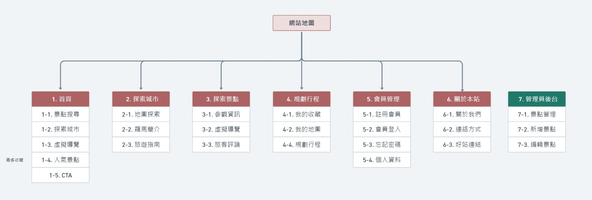

# 藝起逛羅馬 | 義大利旅遊中文資訊網

大家好！✨

這個網站是我參加 2022 六角學院 JS 直播班，

主要課程之外個人發想的專題作品。

專題指導：洧杰老師

Live: https://gretali.github.io/Scopriamo-Roma/pages/index.html

Repo: https://github.com/GretaLi/Scopriamo-Roma

```
**專案資料庫部屬至 Render 需15至30秒伺服器啟動**
測試帳號: testA@gmail.com
測試密碼: test
```

## 首頁截圖


## 專題介紹 | 核心功能

藝起逛羅馬 是一個義大利旅遊資訊網站，使用 RWD 響應式網頁設計，讓使用者可以在不同裝置上瀏覽網頁。網站採用 Vanilla JavaScript 和 JS 函式庫及 JS 套件撰寫，並使用 RESTful API 整合開發，串接資料庫中不同景點的資訊，一手掌握旅遊資訊及景點導覽，讓旅遊不再走馬看花。透過 SVG 互動地圖，使用者可以探索羅馬古城的二十二個分區。會員使用收藏景點功能，可以將景點加入到個人地圖中，輕鬆安排旅遊行程！

---

### 功能及特色
- 探索城市：
    - SVG 互動地圖探索羅馬
    - 以文章呈現羅馬簡介
- 探索景點：
    - 景點搜尋
    - 景點收藏
    - 虛擬導覽結合 Google Map 街景服務介紹重點項目
    - 新增／刪除／修改評論、評論點讚
- 規劃行程：
    - 以列表檢視收藏景點
    - 以地圖檢視收藏景點
- 用戶認證：
    - 會員註冊
    - 會員登入
## 網站地圖



## 使用技術

### 前期規劃

- [Whimsical](https://whimsical.com/) 規劃網站地圖和線搞

- [Figma](https://https://www.figma.com/) 設計風格和安排網站動線規劃

- [Notion](https://www.notion.so/) 管理專題進度以及蒐集技術文章跟內容文本

### 中期開發

- HTML、CSS、Javascript

- SCSS 管理樣式

- [Leaflet.js](https://leafletjs.com/) 串接 [Openstreetmap API](https://www.openstreetmap.org/)

- [Axios.js](https://axios-http.com/) 串接 [Json-server Fake API](https://github.com/typicode/json-server) 及 [Json-server Fake API](https://github.com/jeremyben/json-server-auth)

- [GSAP.js](https://greensock.com/gsap/) 製作部分的動畫和網頁滾動效果

### 後期部屬

- [Render](https://render.com/) 上傳 JSON 檔案模擬伺服器

- [Github](https://github.com/) 部屬整個網站

### 使用套件及參考資源

- [Swiper 輪播效果](https://swiperjs.com/)

- [3D Tilt Effect](https://github.com/gijsroge/tilt.js)

- [首頁圖片雜點 JS](https://codepen.io/mimikos/pen/QMjjzy)

- [Leaflet Sidebar 套件](https://github.com/Turbo87/leaflet-sidebar)

- [SweetAlert2 彈跳視窗](https://sweetalert2.github.io/)

- [圖片蒐集 | Unsplash](https://unsplash.com/)

- [圖片蒐集 | Wikimedia](https://commons.wikimedia.org/wiki/Main_Page)

- [圖片蒐集 | 部分圖片本人實際拍攝]()

- [資料文本 | 羅馬市政博物館系統](https://www.museiincomuneroma.it/it)

- [資料文本 | 羅馬官方旅遊網](https://www.turismoroma.it/)

- [資料文本 | Wikipedia](https://zh.wikipedia.org/)

- [資料文本 | 羅馬、梵諦岡深度之旅@潘錫鳳 (2018 太雅出版)](https://www.books.com.tw/products/0010777377)
